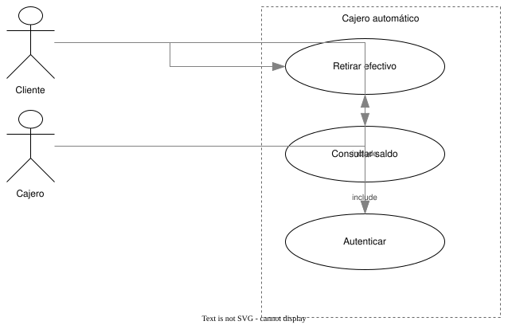
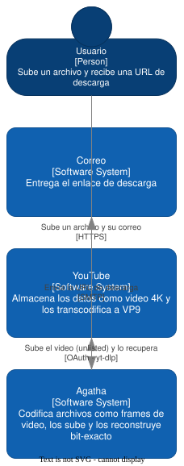
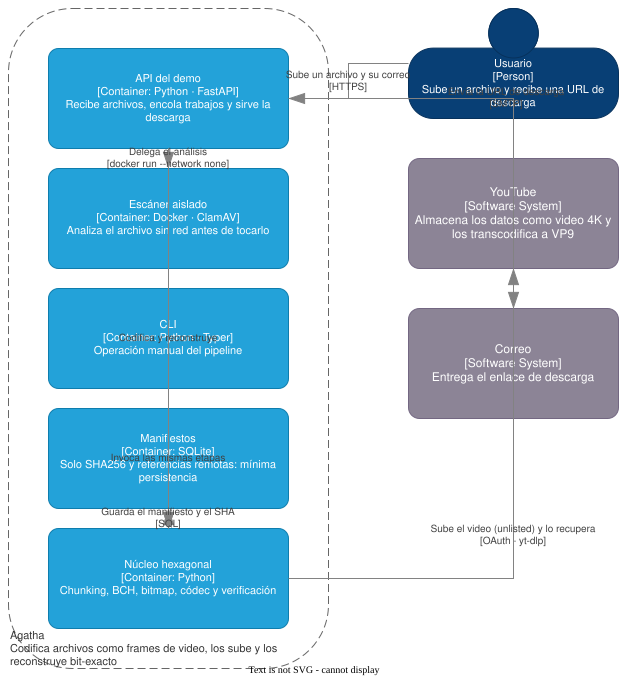
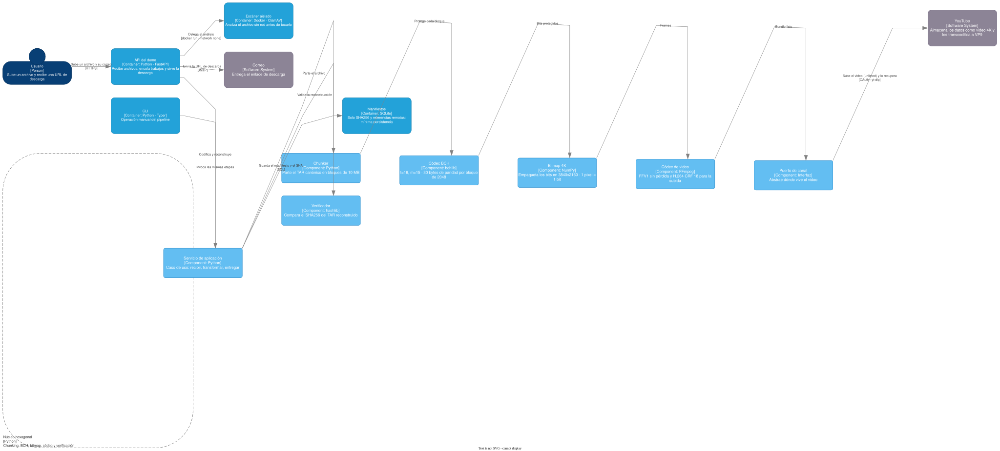

# Ejemplo: el mismo canónico, otra notación (UML de casos de uso)

El valor central del modelo canónico es que no pertenece a C4. El **mismo esquema
normativo** describe C4 hoy y un diagrama UML de casos de uso sin cambiar una
coma: solo cambia el `spec` (el sistema de tipos declarado). Este documento lo
muestra de punta a punta, con salidas reales del motor —no ilustraciones.

Structurizr no puede representar esto: su modelo tiene nueve tipos fijos. El
canónico sí, porque los tipos se declaran.

## 1. El modelo canónico

Un `spec` con tres tipos de nodo (`actor`, `system`, `useCase`) y tres de
relación (`association`, `include`, `extend`). Los mismos tres actores y casos de
uso que dibujaría cualquier herramienta UML:

```json
{
  "version": "1.0",
  "name": "Cajero automático",
  "scope": "undefined",
  "spec": {
    "nodeTypes": {
      "actor":   { "contains": [] },
      "system":  { "contains": ["useCase"] },
      "useCase": { "contains": [] }
    },
    "relationTypes": {
      "association": { "from": ["actor"] },
      "include":     { "from": ["useCase"], "to": ["useCase"] },
      "extend":      { "from": ["useCase"], "to": ["useCase"] }
    }
  },
  "nodes": [
    { "id": "cliente", "type": "actor", "name": "Cliente" },
    { "id": "cajero",  "type": "actor", "name": "Cajero" },
    { "id": "atm", "type": "system", "name": "Cajero automático", "nodes": [
      { "id": "retirar",    "type": "useCase", "name": "Retirar efectivo" },
      { "id": "consultar",  "type": "useCase", "name": "Consultar saldo" },
      { "id": "autenticar", "type": "useCase", "name": "Autenticar" }
    ]}
  ],
  "relations": [
    { "from": "cliente", "to": "retirar",   "type": "association" },
    { "from": "cliente", "to": "consultar", "type": "association" },
    { "from": "cajero",  "to": "retirar",   "type": "association" },
    { "from": "retirar",   "to": "autenticar", "type": "include", "description": "include" },
    { "from": "consultar", "to": "autenticar", "type": "include", "description": "include" }
  ]
}
```

Pasa por el **mismo** `validate_model` que un modelo C4: `undefined` es el único
`scope` que el esquema (heredado de Structurizr) admite fuera de C4; el resto del
modelo es libre.

## 2. Exportado a DSL

El motor lo emite en el lenguaje canónico. El `spec` viaja en el propio texto —
por eso el lenguaje puede describir cualquier notación:

```
model "Cajero automático" {
  spec {
    node actor "Someone who interacts with the system" { leaf }
    node system "The use-case boundary" { contains useCase }
    node useCase "A goal the system fulfils" { leaf }
    relation association "An actor takes part in a use case" { from actor }
    relation include "A use case always includes another" { from useCase  to useCase }
    relation extend  "A use case optionally extends another" { from useCase  to useCase }
  }
  cliente = actor "Cliente"
  cajero = actor "Cajero"
  atm = system "Cajero automático" {
    retirar = useCase "Retirar efectivo"
    consultar = useCase "Consultar saldo"
    autenticar = useCase "Autenticar"
  }
  cliente -association-> retirar
  cliente -association-> consultar
  cajero -association-> retirar
  retirar -include-> autenticar "include"
  consultar -include-> autenticar "include"
}
```

## 3. Exportado a XML de diagrama (drawio)

El exportador lee el `spec` y cambia de plantilla solo: un modelo C4 sale como
vistas C1/C2/C3 separadas; este, al no ser C4, sale como un diagrama UML plano
con las formas nativas de drawio —`shape=umlActor` para los actores, elipses
para los casos de uso, un límite discontinuo para el sistema:

```xml
<mxfile host="arb-mcp"><diagram name="UML"><mxGraphModel ...><root>
  <mxCell id="0"/><mxCell id="1" parent="0"/>
  <mxCell id="cliente" value="&lt;b&gt;Cliente&lt;/b&gt;"
    style="shape=umlActor;verticalLabelPosition=bottom;verticalAlign=top;html=1;outlineConnect=0;"
    vertex="1" parent="1"><mxGeometry x="40" y="40" width="60" height="90" as="geometry"/></mxCell>
  <mxCell id="atm" value="&lt;b&gt;Cajero automático&lt;/b&gt;"
    style="rounded=0;whiteSpace=wrap;html=1;dashed=1;verticalAlign=top;...;container=1;collapsible=0;"
    vertex="1" parent="1">...</mxCell>
  <mxCell id="retirar" value="&lt;b&gt;Retirar efectivo&lt;/b&gt;"
    style="ellipse;whiteSpace=wrap;html=1;" vertex="1" parent="atm">...</mxCell>
  <!-- ... consultar, autenticar como elipses dentro de atm ... -->
  <!-- 5 aristas: association e include -->
</root></mxGraphModel></diagram></mxfile>
```

Abre en drawio como un diagrama de casos de uso editable, con los casos de uso
anidados dentro del límite del sistema.

## Cómo se reproduce

```python
from arb_mcp.domain.loading import load
from arb_mcp.application.convert_model import convert_model, drawio_views

model = load(open("tests/fixtures/uml-casos-uso.json").read())
dsl   = convert_model(model, "arch")   # -> el DSL de arriba
views = drawio_views(model)            # -> [{level: "UML", xml: ...}]
```

El test `tests/test_uml.py` fija este camino: valida contra el mismo esquema,
exporta a DSL, y comprueba que el drawio usa el stencil UML y no el de C4.

## Renderizado (SVG real de drawio)

Estos SVG los produjo el motor de render de drawio a partir del XML de arriba —no
son una aproximación. El de UML usa el stencil `umlActor` y elipses; los de C4,
los stencils `mxgraph.c4`:

**UML — casos de uso**



**C4 — el mismo mecanismo, otra notación** (sistema de ejemplo Agatha):

| C1 Contexto | C2 Contenedores | C3 Componentes |
|---|---|---|
|  |  |  |

Se generan cargando el XML del MCP en el motor `viewer-static.min.js` de drawio y
exportando con `graph.getSvg()`. El resultado es autocontenido: entra en una
página web o en un PDF sin dependencias.
